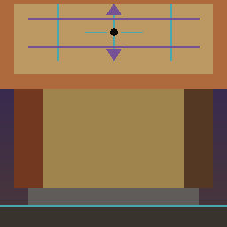
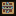
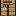
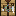
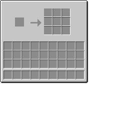

# The Uncrafting Table

<p align="center">
  
</p>

A NeoForge mod for **Minecraft 26.1.2** that adds a block to reverse crafting recipes — turn crafted items back into their original ingredients.

The block and GUI use a **reversed crafting-table** look: a raised 3×3 grid with a hollow center, outward arrows, and subtle cyan/purple accents on the grid lines.

Repository: [github.com/PsyCrow1976/The-Uncrafting-Table](https://github.com/PsyCrow1976/The-Uncrafting-Table)

**Current version:** 0.0.1

## Visuals

### Block textures

Custom 16×16 block faces (shown below at 8× scale). The top face inverts the vanilla crafting table: recessed slots become raised ridges, the center is hollow, and arrows point outward.

<p align="center">
  
  &nbsp;
  
  &nbsp;
  
</p>

<p align="center"><em>Top · Side · Front</em></p>

### GUI

The uncrafting screen keeps vanilla slot positions (input on the left, 3×3 recipe preview on the right) with an oak-toned frame and accent highlights on the preview grid.

<p align="center">
  
</p>

<p align="center"><em>GUI texture (176×166 active area)</em></p>

CurseForge listing artwork and a screenshot template live under [`branding/`](branding/).

## Requirements

| Component | Version |
|-----------|---------|
| Minecraft | 26.1.2 |
| NeoForge | 26.1.2.76 |
| Java (build) | JDK 25 |

See [requirements.md](requirements.md) for full details, core functionality, and build instructions.

## How it works

1. **Craft** an Uncrafting Table using the configured recipe (default: oak planks, obsidian, and diamond), or find it in the Functional Blocks creative tab.
2. **Place** the block and right-click to open the GUI.
3. **Insert** a single item into the input slot on the left.
4. **Preview** the matched crafting recipe — ingredients appear in the 3×3 grid on the right, with a decorative outward-arrow motif between input and preview.
5. **Click** any preview slot to uncraft — the input is consumed and all ingredients are placed in your inventory.
6. **Close** the GUI — any item still in the input slot is returned to your inventory (or dropped at your feet if inventory is full).

Uncraft is cancelled if your inventory cannot hold every ingredient; the input item is never partially consumed.

### GUI & visuals

See [Visuals](#visuals) above for preview images. The interface uses a custom mod-owned GUI texture (`uncrafting_table.png`) with slot backgrounds baked in; menu slot positions align exactly with the texture (input at 30,35; preview 3×3 at 88,17). Block and item models use the custom textures shown in the README.

Regenerate assets from vendored references:

```bash
pip install Pillow
python3 scripts/generate_visual_assets.py
```

Reference PNGs live under `scripts/refs/` (vanilla-derived side/front textures and a frozen pre-reskin GUI baseline).

### Limitations (current)

- Only **crafting table** recipes are reversed (not smelting, stonecutting, etc.).
- When multiple recipes produce the same item, the **first match** is shown (recipe cycling UI is planned).
- Shapeless recipes with more than 9 ingredients show only the first 9 in the preview grid.

## Configuration

After first launch, edit `config/uncraftingtable-common.toml`:

```toml
[general]
craftable = true
useCustomCraftingRecipe = true
customCraftingPattern = ["POP", "ODO", "POP"]
customCraftingKeys = ["P=minecraft:oak_planks", "O=minecraft:obsidian", "D=minecraft:diamond"]
blockedInputItems = []
blockDamagedToolsAndWeapons = true

[Debugging]
debug = true
testModeOnlyBookshelf = false
```

## Installation (players)

1. Install NeoForge **26.1.2.76** for Minecraft **26.1.2**.
2. Download `uncraftingtable-0.0.1.jar` from [Releases](https://github.com/PsyCrow1976/The-Uncrafting-Table/releases) or build it yourself (below).
3. Copy the JAR into your instance `mods/` folder (remove any older `uncraftingtable-*.jar` versions).
4. Launch the game.

## Building from source

Requires **JDK 25** (64-bit). Gradle wrapper is included.

```bash
git clone https://github.com/PsyCrow1976/The-Uncrafting-Table.git
cd The-Uncrafting-Table
./gradlew build
```

The mod JAR is produced at:

```
build/libs/uncraftingtable-0.0.1.jar
```

### Dev client

```bash
./gradlew runClient
```

### Releasing a new version

1. Update `mod_version` in `gradle.properties`
2. Add an entry to `changelog.md`
3. Run `./gradlew build`
4. Publish `build/libs/uncraftingtable-<version>.jar`

## Project layout

```
src/main/java/com/psycrow/uncraftingtable/
├── block/              UncraftingTableBlock
├── blockentity/        UncraftingTableBlockEntity
├── client/             UncraftingTableScreen (GUI)
├── config/             ModConfig
├── menu/               UncraftingTableMenu, PreviewSlot
├── network/            Packets and server handlers
├── recipe/             RecipeResolver (reverse crafting)
└── registry/           Blocks, items, block entities, menus

src/main/resources/
├── assets/uncraftingtable/   Models, lang, blockstates, GUI texture & atlas
└── data/uncraftingtable/     Recipes, loot tables
```

## Changelog

See [changelog.md](changelog.md). Development build history (`0.0.0.x`) is in [changelog-dev.md](changelog-dev.md).

## License

All Rights Reserved (see [TEMPLATE_LICENSE.txt](TEMPLATE_LICENSE.txt)).